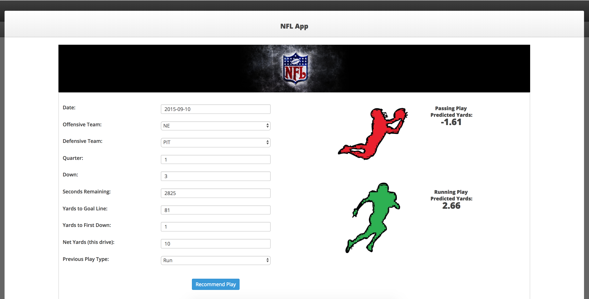

<h3>Spark NFL Predictions</h3>
This project deploys a pyspark model that is used to predict the next NLF play. Specfically, there are two models and I trained on historical NFL Play-by-Play data. There's one model that predicts the expected yards gained or lost for a running play, and similarly a model that predicts yards gained or lost for a passing play. The model will output the expected yardage as well as which play (running or passing) should be executed. 
 
 <b>To run:</b>
 
 NOTE: Before you begin, make sure you have Docker installed. This app is deployed and runs within a docker container.
 
 &nbsp;&nbsp;&nbsp;&nbsp;&bull;&nbsp;1) Download this repo
 &nbsp;&nbsp;&nbsp;&nbsp;&bull;&nbsp;2) <code>./build.sh</code>
 &nbsp;&nbsp;&nbsp;&nbsp;&bull;&nbsp;3) <code>./run.sh</code>
 &nbsp;&nbsp;&nbsp;&nbsp;&bull;&nbsp;4) Wait a minute or two, then open up your browser and go to <a href="http://localhost:14444">http://localhost:14444</a>
 
 
 
 
